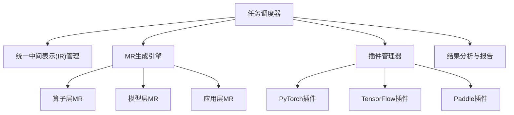

# **DeepMT 项目技术与设计报告**
> 面向深度学习框架的蜕变关系自动生成与分层测试体系

## 1. 项目背景
深度学习框架（如 PyTorch、TensorFlow、PaddlePaddle）是 AI 应用的计算核心，但测试存在 **测试预言机（Oracle Problem）** 难题。  
蜕变测试（Metamorphic Testing, MT）通过 **输入变换下的不变量关系（MR）** 来发现隐藏缺陷，特别适合深度学习系统。

本项目目标：  
- 构建 **分层测试体系**（算子层、模型层、应用层）  
- 开发 **多源融合 MR 自动生成引擎**  
- 提供 **跨框架自动化测试执行框架**  
- 支持 **大规模缺陷检测与报告生成**

---

## 2. 系统总体架构



模块说明：
1. **IR层**：抽象描述算子、模型、应用，实现跨框架无关性  
2. **MR引擎**：
   - 算子层：形式化规约 + SMT求解器  
   - 模型层：结构分析 + 数据增强  
   - 应用层：LLM 语义生成  
3. **执行框架**：微内核 + 插件化架构  
4. **分析系统**：缺陷检测、分类、最小化、可视化  

---

## 3. 文件目录结构

```
DeepMT/
│
├── README.md
├── requirements.txt
├── config.yaml
│
├── core/                     # 微内核框架
│   ├── scheduler.py
│   ├── ir_manager.py
│   ├── results_manager.py
│   ├── plugins_manager.py
│   └── logger.py
│
├── mr_generator/
│   ├── operator_mr.py        # 算子层
│   ├── model_mr.py           # 模型层
│   ├── app_mr.py             # 应用层
│   ├── knowledge_base.py
│   └── llm_utils.py
│
├── ir/
│   ├── schema.py             # IR数据结构
│   ├── converter.py          # IR<->框架代码
│   └── validators.py
│
├── plugins/
│   ├── pytorch_plugin.py
│   ├── tensorflow_plugin.py
│   └── paddle_plugin.py
│
├── analysis/
│   ├── defect_classifier.py
│   ├── minimizer.py
│   ├── report_generator.py
│   └── visualizer.py
│
├── tests/
│   ├── sample_ops.json
│   ├── sample_models.json
│   └── sample_apps.json
│
├── scripts/
│   ├── run_tests.py
│   ├── build_ir.py
│   └── demo_pipeline.py
│
└── data/
    ├── defects.db
    └── logs/
```

---

## 4. 核心模块设计

### 4.1 微内核（core/）

**scheduler.py**
```python
class TaskScheduler:
    def __init__(self, ir_manager, mr_generator, plugins_manager, results_manager):
        self.ir_manager = ir_manager
        self.mr_generator = mr_generator
        self.plugins_manager = plugins_manager
        self.results_manager = results_manager

    def run_task(self, ir_object, target_framework):
        mrs = self.mr_generator.generate(ir_object)
        results = []
        for mr in mrs:
            plugin = self.plugins_manager.get_plugin(target_framework)
            code = plugin.ir_to_code(ir_object, mr)
            output = plugin.execute(code)
            results.append((mr, output))
        self.results_manager.compare_and_store(ir_object, results)
```

---

### 4.2 MR生成引擎（mr_generator/）

#### operator_mr.py
```python
class OperatorMRGenerator:
    def __init__(self, knowledge_base):
        self.kb = knowledge_base

    def generate(self, operator_ir):
        return self.kb.get_mrs_for_operator(operator_ir.name)
```

#### model_mr.py
```python
class ModelMRGenerator:
    def __init__(self, transform_library):
        self.transforms = transform_library

    def generate(self, model_ir):
        layers = model_ir.get_layers()
        return [t.to_mr(model_ir) for t in self.transforms if t.compatible_with(layers)]
```

#### app_mr.py
```python
class ApplicationMRGenerator:
    def __init__(self, llm_client):
        self.llm = llm_client

    def generate(self, app_ir):
        desc = self.llm.ask(f"Generate MR for {app_ir.description}")
        return self.parse_description_to_code(desc)
```

---

### 4.3 IR数据结构（ir/schema.py）
```python
from dataclasses import dataclass

@dataclass
class OperatorIR:
    name: str
    inputs: list
    outputs: list
    properties: dict

@dataclass
class ModelIR:
    name: str
    layers: list
    connections: list

@dataclass
class ApplicationIR:
    name: str
    purpose: str
    input_format: str
    output_format: str
```

---

### 4.4 插件示例（plugins/pytorch_plugin.py）
```python
class PyTorchPlugin:
    def ir_to_code(self, ir_object, mr):
        return "python_code_string"

    def execute(self, code_str):
        exec_globals = {}
        exec(code_str, exec_globals)
        return exec_globals["output"]
```

---

## 5. 开发路线

| 阶段  | 时间 | 主要任务                   |
| ----- | ---- | -------------------------- |
| 阶段1 | 2周  | 定义IR层，支持算子表示     |
| 阶段2 | 2周  | 算子层MR生成（形式化规则） |
| 阶段3 | 3周  | 微内核+PyTorch插件闭环     |
| 阶段4 | 2周  | 模型层MR模块+结构分析      |
| 阶段5 | 3周  | 应用层LLM MR生成           |
| 阶段6 | 2周  | 缺陷分析与报告             |
| 阶段7 | 4周  | 大规模实证研究             |

---

## 6. 技术选型

| 模块     | 技术                              |
| -------- | --------------------------------- |
| IR       | Python dataclass, JSON/YAML       |
| MR算子层 | SymPy, Z3 SMT                     |
| MR模型层 | NetworkX, Albumentations          |
| MR应用层 | LangChain, GPT/LLaMA              |
| 框架插件 | PyTorch, TensorFlow, PaddlePaddle |
| 报告     | Pandas, Jinja2                    |
